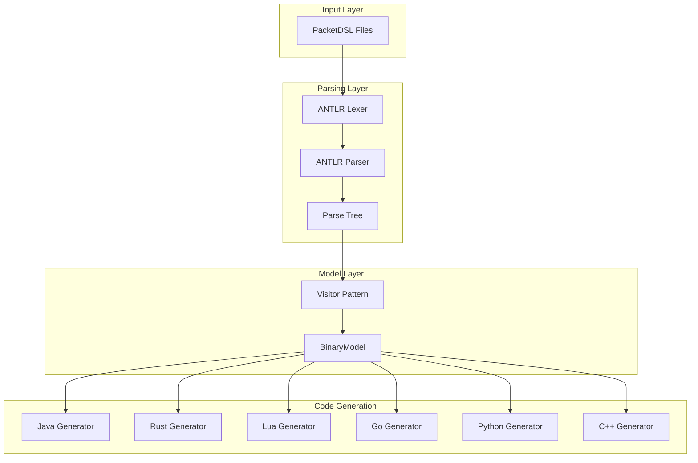
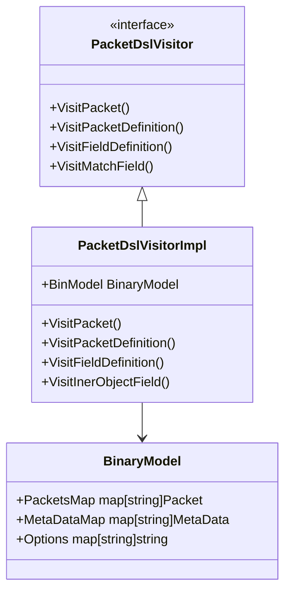
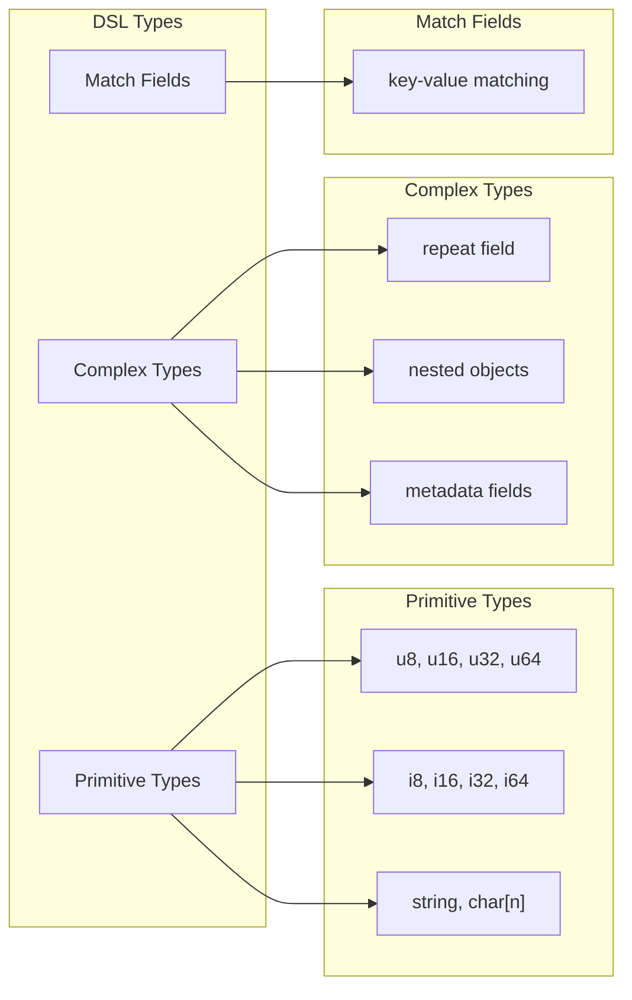

# fin-protoc

A multi-language protocol compiler that transforms PacketDSL definitions into executable code for binary packet serialization and deserialization across Java, Rust, Lua (Wireshark), Go, Python, and C++. [1](#0-0)

## Architecture Overview

The fin-protoc system follows a three-stage compilation pipeline: parsing DSL files using ANTLR-generated components, transforming parse trees into internal models via the visitor pattern, and generating language-specific code through pluggable generators. [2](#0-1)



## Core Components

### Parser Architecture

The parsing system uses ANTLR 4.13.2 to generate lexer and parser components from the PacketDsl.g4 grammar file [3](#0-2) . The `PacketDslLexer` handles tokenization with 36 token types, while the `PacketDslParser` implements 13 parser rules for different grammar constructs [4](#0-3) .

### Visitor Pattern Implementation

The visitor pattern transforms ANTLR parse trees into strongly-typed Go data structures [5](#0-4) . The `PacketDslVisitorImpl` processes different context types through specialized methods:



### Multi-Language Code Generation

The code generation system supports six target languages through a unified `Generator` interface . Each generator produces language-specific serialization code:

| Language | Output               | Key Features                             |
| -------- | -------------------- | ---------------------------------------- |
| Java     | BinaryCodec classes  | Netty ByteBuf integration, JUnit tests   |
| Rust     | BinaryCodec traits   | Zero-copy serialization, bytes crate     |
| Lua      | Wireshark dissectors | TCP port binding, ProtoField definitions |
| Go       | Structs with methods | Native Go serialization                  |
| Python   | Classes with methods | Python serialization                     |
| C++      | Classes with methods | C++ serialization support                |

## Field Type System

The DSL supports various field types with language-specific mappings:



## Usage

The primary interface is through the compile command, which processes DSL files and generates target language code :

```bash
# generate code for rust
fin-protoc -f input.dsl -r ./src
# generate code for lua (Wireshark)
fin-protoc -f input.dsl -l ./src
# generate code for java
fin-protoc -f input.dsl -j ./src
# generate code for go
fin-protoc -f input.dsl -g ./src
# generate code for python
fin-protoc -f input.dsl -p ./src
# generate code for c++
fin-protoc -f input.dsl -c ./src
```

The compilation process:

1. Parses DSL files using ANTLR-generated components
2. Transforms parse trees via visitor pattern
3. Generates language-specific code through appropriate generators
4. Organizes output files with proper module structure

## Notes

The codebase demonstrates a well-structured compiler architecture with clear separation between parsing, model transformation, and code generation phases. The ANTLR integration provides robust grammar processing, while the visitor pattern enables clean transformation logic. The multi-language generator system allows consistent code generation across diverse target platforms.

[](https://deepwiki.com/xinchentechnote/fin-protoc)
