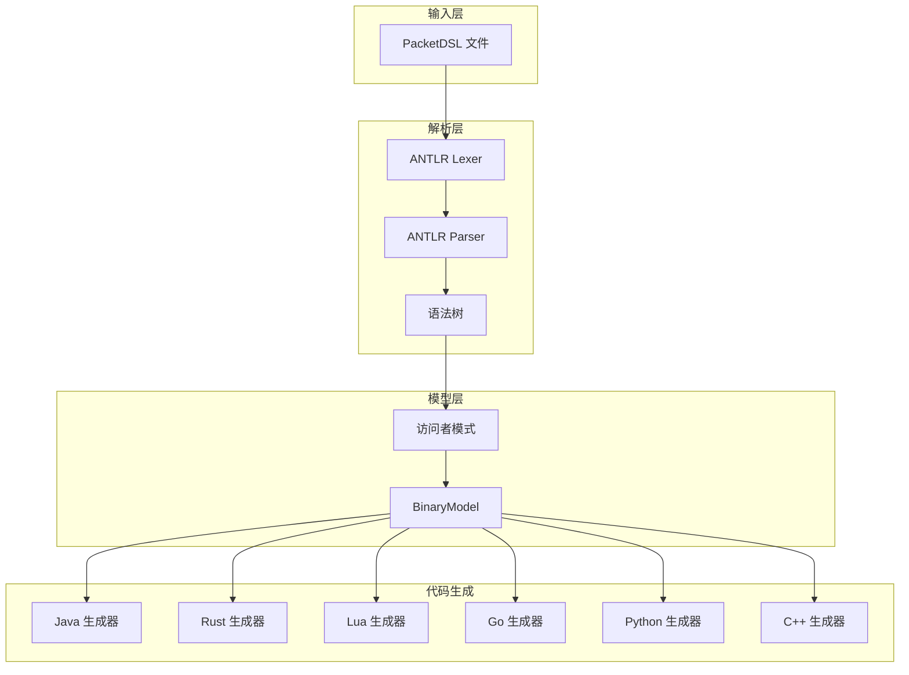
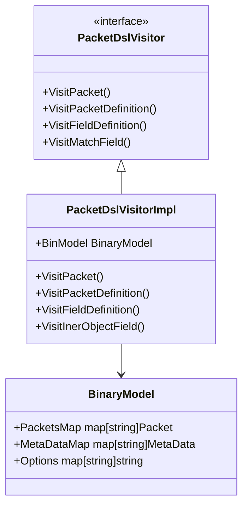
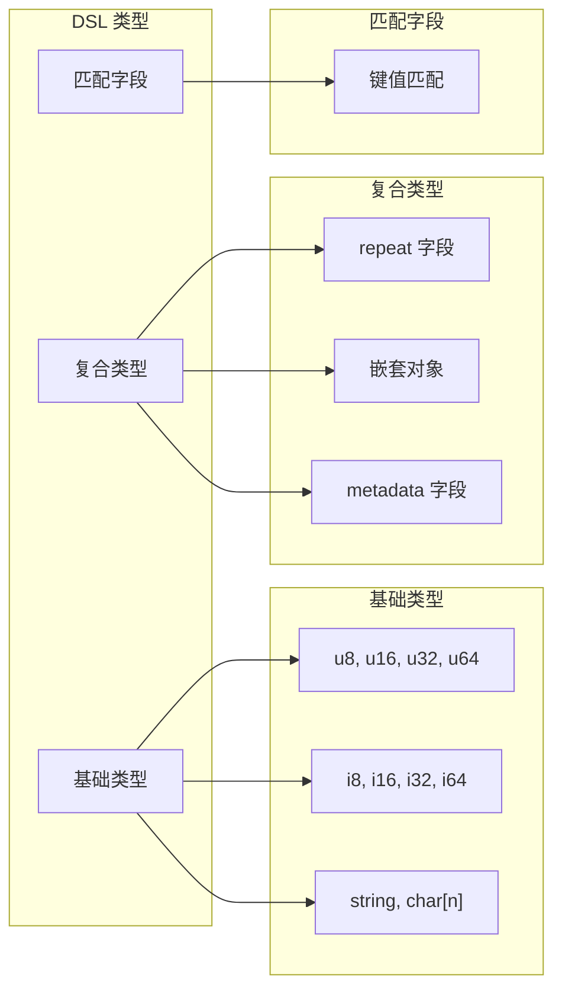

# fin-protoc

[English](readme-en.md) | 简体中文

fin-protoc 是一个强大的多语言协议编译器，可将 PacketDSL 协议定义转换为可执行的二进制报文序列化/反序列化代码，支持 **Java**、**Rust**、**Lua（Wireshark）**、**Go**、**Python** 和 **C++** 六种编程语言。

开发者只需定义一次二进制通信协议，即可在多个平台上获得一致且类型安全的实现，从而免去为每种目标语言手工编写协议编解码代码这一繁琐且易出错的过程。

---

在现代分布式系统中，尤其是**金融交易**、**游戏**和**网络通信**领域，二进制协议对性能敏感的应用至关重要。然而，跨多种语言实现同一协议面临着一系列挑战：

- **代码重复**：需要在多种语言中编写并维护序列化/反序列化逻辑
- **一致性风险**：各语言实现之间的协议漂移（protocol drift）可能引发隐蔽的 bug
- **开发开销**：协议的每次变更都需要同步更新所有语言的实现
- **测试复杂度**：确保所有实现行为完全一致，需要大量的跨语言测试

---

fin-protoc 通过提供单一事实来源（single source of truth）的协议定义来解决上述问题，并为每种目标语言生成优化过的、符合语言习惯的代码。

## 架构总览

fin-protoc 采用三段式编译流水线：先使用 ANTLR 生成的组件解析 DSL 文件，再通过访问者模式（visitor pattern）将语法树转换为内部模型，最后由可插拔的生成器产出各语言的代码。


```mermaid
graph TB
    subgraph "输入层"
        A[PacketDSL 文件]
    end

    subgraph "解析层"
        B[ANTLR Lexer]
        C[ANTLR Parser]
        D[语法树]
    end

    subgraph "模型层"
        E[访问者模式]
        F[BinaryModel]
    end

    subgraph "代码生成"
        G[Java 生成器]
        H[Rust 生成器]
        I[Lua 生成器]
        J[Go 生成器]
        K[Python 生成器]
        L[C++ 生成器]
    end

    A --> B
    B --> C
    C --> D
    D --> E
    E --> F
    F --> G
    F --> H
    F --> I
    F --> J
    F --> K
    F --> L
```

## 核心组件

### 解析器架构

解析系统使用 ANTLR 4.13.2 从 `PacketDsl.g4` 语法文件生成词法分析器与语法分析器。`PacketDslLexer` 负责词法分析（36 种 token 类型），`PacketDslParser` 实现了覆盖各类语法结构的 13 条语法规则。

### 访问者模式

访问者模式将 ANTLR 语法树转换为强类型的 Go 数据结构。`PacketDslVisitorImpl` 通过专门的方法处理各类上下文：


```mermaid
classDiagram
    class PacketDslVisitor {
        <<interface>>
        +VisitPacket()
        +VisitPacketDefinition()
        +VisitFieldDefinition()
        +VisitMatchField()
    }

    class PacketDslVisitorImpl {
        +BinModel BinaryModel
        +VisitPacket()
        +VisitPacketDefinition()
        +VisitFieldDefinition()
        +VisitInerObjectField()
    }

    class BinaryModel {
        +PacketsMap map[string]Packet
        +MetaDataMap map[string]MetaData
        +Options map[string]string
    }

    PacketDslVisitor <|-- PacketDslVisitorImpl
    PacketDslVisitorImpl --> BinaryModel
```

### 多语言代码生成

代码生成系统通过统一的 `Generator` 接口支持六种目标语言。每个生成器产出对应语言的序列化代码：

| 语言    | 输出                  | 关键特性                                  |
| ------- | --------------------- | ----------------------------------------- |
| Java    | BinaryCodec 类        | Netty ByteBuf 集成、JUnit 测试            |
| Rust    | BinaryCodec trait     | 零拷贝序列化、bytes crate                 |
| Lua     | Wireshark 解析器      | TCP 端口绑定、ProtoField 定义             |
| Go      | 带方法的结构体        | 原生 Go 序列化                            |
| Python  | 带方法的类            | Python 序列化                             |
| C++     | 带方法的类            | C++ 序列化支持                            |

## 字段类型系统

DSL 支持多种字段类型，并映射到各语言的特定类型：


```mermaid
graph LR
    subgraph "DSL 类型"
        A[基础类型]
        B[复合类型]
        C[匹配字段]
    end

    subgraph "基础类型"
        D["u8, u16, u32, u64"]
        E["i8, i16, i32, i64"]
        F["string, char[n]"]
    end

    subgraph "复合类型"
        G["repeat 字段"]
        H["嵌套对象"]
        I["metadata 字段"]
    end

    subgraph "匹配字段"
        K["键值匹配"]
    end

    A --> D
    A --> E
    A --> F
    B --> G
    B --> H
    B --> I
    C --> K
```

## 使用方法

主要入口是 compile 命令，它处理 DSL 文件并生成目标语言代码：

```bash
# 生成 rust 代码
fin-protoc -f input.dsl -r ./src
# 生成 lua（Wireshark）代码
fin-protoc -f input.dsl -l ./src
# 生成 java 代码
fin-protoc -f input.dsl -j ./src
# 生成 go 代码
fin-protoc -f input.dsl -g ./src
# 生成 python 代码
fin-protoc -f input.dsl -p ./src
# 生成 c++ 代码
fin-protoc -f input.dsl -c ./src
```

编译流程：

1. 使用 ANTLR 生成的组件解析 DSL 文件
2. 通过访问者模式转换语法树
3. 由相应的生成器生成各语言代码
4. 按合理的模块结构组织输出文件

## 应用生态

fin-protoc 编译器已在多个语言实现中落地应用，以确保二进制协议定义与编解码逻辑的一致性：

- [`fin-proto`](https://github.com/xinchentechnote/fin-proto)

  - 综合性金融协议库
  - 支持上交所（SSE）、深交所（SZSE）及风控协议
  - 含 Wireshark 用的 Lua 解析器

- [`fin-proto-rs`](https://github.com/xinchentechnote/fin-proto-rs)

  - 高性能 Rust 二进制编解码
  - 零拷贝序列化/反序列化
  - 支持上交所（SSE）、深交所（SZSE）及风控协议
  - 内置单元测试基础设施

- [`fin-proto-go`](https://github.com/xinchentechnote/fin-proto-go)

  - 协议的 Go 原生实现
  - 标准化的 codec 接口
  - 模块化、按交易所划分的架构
  - 该仓库已被集成进 [`gt-auto`](https://github.com/xinchentechnote/gt-auto)——一个面向金融系统（网关、撮合引擎等）的自动化测试工具

- [`fin-proto-cpp`](https://github.com/xinchentechnote/fin-proto-cpp)

  - 高效的 C++ 实现
  - 支持上交所（SSE）、深交所（SZSE）及风控协议
  - 经过优化的序列化逻辑

- [`fin-proto-java`](https://github.com/xinchentechnote/fin-proto-java)

  - Java 二进制协议 codec
  - Netty ByteBuf 集成
  - Gradle 构建系统
  - 兼容 Java 17+

- [`fin-proto-py`](https://github.com/xinchentechnote/fin-proto-py)

  - 面向金融协议的 Python 实现
  - 支持上交所（SSE）、深交所（SZSE）及风控协议
  - 提供易用的解析与序列化 API

- [`fin-proto-vscdoe`](https://github.com/xinchentechnote/fin-proto-vscdoe)

  - 面向协议开发的 Visual Studio Code 扩展
  - 直观的语法高亮
  - 代码格式化
  - 代码补全
  - 错误提示

- [`fin-proto-plugin`](https://github.com/xinchentechnote/fin-proto-plugin)

  - fin-proto 的 IntelliJ IDEA 插件
  - 与 fin-protoc 的 .so 文件集成

这些项目共同展示了 fin-protoc 如何让协议定义在不同技术生态之间共享、并保持一致的执行行为。

## 说明

该代码库展现了结构清晰的编译器架构：解析、模型转换与代码生成三个阶段职责分明。ANTLR 集成提供了健壮的语法处理能力，访问者模式让转换逻辑保持整洁，多语言生成器系统则保证了跨平台产物的一致性。

[](https://deepwiki.com/xinchentechnote/fin-protoc)
